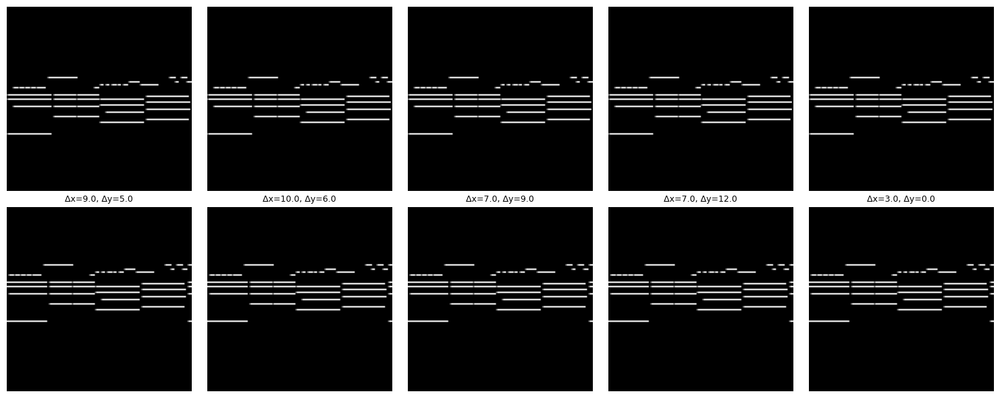

# data


<!-- WARNING: THIS FILE WAS AUTOGENERATED! DO NOT EDIT! -->

------------------------------------------------------------------------

### PRPairDataset

``` python

def PRPairDataset(
    image_dataset_dir:str='~/datasets/POP909_images/', crop_size:int=128, max_shift_x:int=10, max_shift_y:int=12,
    split:str='train', val_fraction:float=0.1, seed:int=42, verbose:bool=True
):

```

*piano roll pair dataset*

Code to test that:

``` python
data = PRPairDataset()
print("len(data) =",len(data))
print("data.actual_len =",data.actual_len)
data_dict = next(iter(data)) 
print("data_dict =n",data_dict)

# Let's take the sum to make sure there's some non-zero pixel values
for imstr in ['img1','img2']:
    print(f"data_dict['{imstr}'].sum() = ",data_dict[imstr].sum())
```

    Loading 818 train files from ~/datasets/POP909_images/...
    Finished loading.
    len(data) = 81800
    data.actual_len = 818
    data_dict =n {'img1': tensor([[[0., 0., 0.,  ..., 0., 0., 0.],
             [0., 0., 0.,  ..., 0., 0., 0.],
             [0., 0., 0.,  ..., 0., 0., 0.],
             ...,
             [0., 0., 0.,  ..., 0., 0., 0.],
             [0., 0., 0.,  ..., 0., 0., 0.],
             [0., 0., 0.,  ..., 0., 0., 0.]]]), 'img2': tensor([[[0., 0., 0.,  ..., 0., 0., 0.],
             [0., 0., 0.,  ..., 0., 0., 0.],
             [0., 0., 0.,  ..., 0., 0., 0.],
             ...,
             [0., 0., 0.,  ..., 0., 0., 0.],
             [0., 0., 0.,  ..., 0., 0., 0.],
             [0., 0., 0.,  ..., 0., 0., 0.]]]), 'deltas': tensor([3., 9.]), 'file_idx': 201}
    data_dict['img1'].sum() =  tensor(337.7961)
    data_dict['img2'].sum() =  tensor(340.7451)

``` python
import matplotlib.pyplot as plt

samples = [data[i] for i in range(5)]
fig, axes = plt.subplots(2, 5, figsize=(15, 6))
print("top row: img1, bottom row: img2")
for i in range(5):
    sample = samples[i]
    for j, imstr in enumerate(['img1','img2']): 
        axes[j, i].imshow(data_dict[imstr].squeeze(), cmap='gray') # top row: img1, bottom row: img2
        axes[j, i].axis('off')
    axes[1, i].set_title(f"Δx={sample['deltas'][0]}, Δy={sample['deltas'][1]}", fontsize=9)

plt.tight_layout()
plt.show()
```

    top row: img1, bottom row: img2


