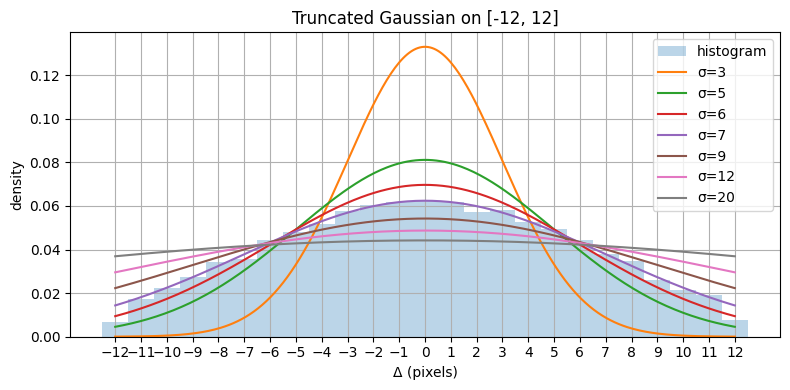
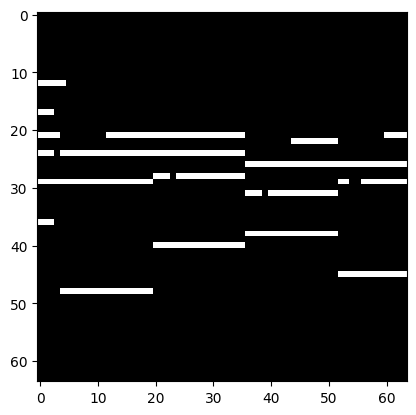
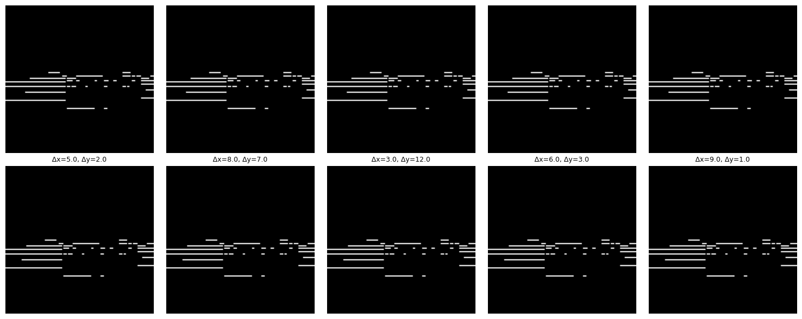
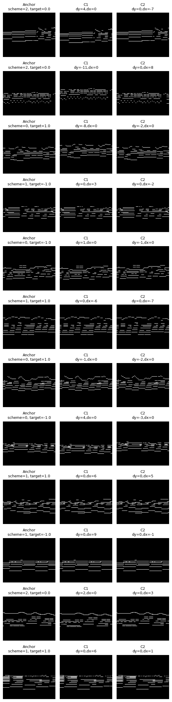

# data


<!-- WARNING: THIS FILE WAS AUTOGENERATED! DO NOT EDIT! -->

------------------------------------------------------------------------

### shift_no_wrap

``` python

def shift_no_wrap(
    x, shifts, dims
):

```

*Drop-in replacement for torch.roll with zero-fill instead of wrap.*

------------------------------------------------------------------------

### sample_shift

``` python

def sample_shift(
    max_shift, sigma:int=7, size:NoneType=None
):

```

*Samples shifts amounts as integers from a truncated normal
distribution*

That truncated normal distribution reads from the following. And we’ll
test sample_shift too:

``` python
import matplotlib.pyplot as plt

ms, sigma = 12, 7 # max shift, sigma 
x = np.linspace(-ms, ms, 300)
fig, ax = plt.subplots(figsize=(8, 4))
samples = sample_shift(ms, sigma, size=20000)
ax.hist(samples, bins=np.arange(-ms-0.5, ms+1.5), density=True, alpha=0.3, label='histogram')
                       
for sigma in [3, 5, 6, 7, 9, 12, 20]:
    a, b = -ms/sigma, ms/sigma
    ax.plot(x, truncnorm.pdf(x, a, b, loc=0, scale=sigma), label=f'σ={sigma}')
ax.set_xlabel('Δ (pixels)'); ax.set_ylabel('density')
ax.set_xticks(np.arange(-ms, ms+1))
ax.legend(); ax.set_title(f'Truncated Gaussian on [-{ms}, {ms}]'); ax.grid(True)
plt.tight_layout(); plt.show()
```



## Weighting By Shortness of Note Length

Longer notes are easy. Short notes tend to be the challenge for
reconstruction.

------------------------------------------------------------------------

### note_length_weights

``` python

def note_length_weights(
    img, min_weight:float=1.0, power:float=0.5
):

```

*note weight is inversely proportional to note length*

## AnchorDataset

Main dataset for single-image loading, called by multi-image loaders

------------------------------------------------------------------------

### AnchorDataset

``` python

def AnchorDataset(
    image_dataset_dir:str='~/datasets/POP909_images_basic/',
    crop_size:int=128, # int for square of tuple for rectangle
    split:str='train', val_fraction:float=0.1, seed:int=42, verbose:bool=True,
    aug_y_max:int=12, # number of pitch semitones +/- for data augmentation
    sigma:int=7, # truncnorm tightness param for aug_y
    pad_x:tuple=(0, 0), # (left, right) : crop wider to (crop_sizw-pad_x[0], crop_size+pad_x[1])
):

```

*piano roll pair dataset*

Analyze / get statistics about the data:

``` python
ds = AnchorDataset(split='val', crop_size=(64,64))
data = ds.__getitem__(0)
img = data['img'].squeeze()
print("img.shape =",img.shape) 
plt.imshow(img, cmap='gray')
plt.show()
plt.close()
```

    Loading 91 val files from ~/datasets/POP909_images_basic/... Finished loading.
    img.shape = torch.Size([64, 64])



``` python
from tqdm.auto import tqdm 

ds = AnchorDataset()
min_pitch, max_pitch = 127, 0
print("Measuring min/max pitch")
for img in tqdm(ds.images):
    has_note = img.any(axis=-1)
    pitch_indices = np.where(has_note)[0]
    if len(pitch_indices) > 0:
        min_pitch = min(min_pitch, pitch_indices.min())
        max_pitch = max(max_pitch, pitch_indices.max())

print(f"Pitch range: {min_pitch} to {max_pitch}")
print(f"Pitch shift headroom: {128-max_pitch} on top, {min_pitch} on bottom")

total_white, total_pixels = 0, 0  
print("\nMeasuring white/black pixels (in main musical range)")
crop_top, crop_bottom = 64+16, 64-16 # middle quarter 
for img in tqdm(ds.images):
    total_white += img[crop_bottom:crop_top+1,:].sum()
    total_pixels += img[crop_bottom:crop_top+1,:].size

frac = total_white / total_pixels
print(f"{len(ds.images)} images: Averages: {total_white/len(ds.images):.0f} white pixels per song, = {frac * 100:.2f}% white")
print(f"Avg pixels (in relevant range) per image: {total_pixels/len(ds.images):.0f}")

area_per_crop = (max_pitch-min_pitch+1) * 128
avg_white_per_crop = frac * area_per_crop
print(f"Avg white pixels per crop: {avg_white_per_crop:.0f}")
print(f"Suggests a BCE pos_weight of {(1-frac)/frac:.0f} to mitigate class imbalance")
```

    Loading 818 train files from ~/datasets/POP909_images_basic/... Finished loading.
    Measuring min/max pitch

      0%|          | 0/818 [00:00<?, ?it/s]

    Pitch range: 21 to 103
    Pitch shift headroom: 25 on top, 21 on bottom

    Measuring white/black pixels (in main musical range)

      0%|          | 0/818 [00:00<?, ?it/s]

    818 images: Averages: 11077 white pixels per song, = 12.52% white
    Avg pixels (in relevant range) per image: 88489
    Avg white pixels per crop: 1330
    Suggests a BCE pos_weight of 7 to mitigate class imbalance

------------------------------------------------------------------------

### sample_shifts

``` python

def sample_shifts(
    max_x, max_y, sigma
):

```

*Get X and Y shifts; one of them must be non-zero*

------------------------------------------------------------------------

### PRPairDataset

``` python

def PRPairDataset(
    image_dataset_dir:str='~/datasets/POP909_images_basic', crop_size:int=128, max_shift_x:int=12,
    max_shift_y:int=12, split:str='train', val_fraction:float=0.1, seed:int=42, verbose:bool=True,
    sigma:int=7, # param for truncnorm dist for sampling shifts/deltas
    shared:NoneType=None, # Possible shared memory thing for changing deets on the fly
):

```

*piano roll pair dataset*

Code to test that:

``` python
data = PRPairDataset()
print("len(data) =",len(data))
print("data.actual_len =",data.actual_len)
data_dict = next(iter(data)) 
print("data_dict =n",data_dict)

# Let's take the sum to make sure there's some non-zero pixel values
for imstr in ['img1','img2']:
    print(f"data_dict['{imstr}'].sum() = ",data_dict[imstr].sum())
```

    Loading 818 train files from ~/datasets/POP909_images_basic... Finished loading.
    len(data) = 81800
    data.actual_len = 818
    data_dict =n {'img1': tensor([[[0., 0., 0.,  ..., 0., 0., 0.],
             [0., 0., 0.,  ..., 0., 0., 0.],
             [0., 0., 0.,  ..., 0., 0., 0.],
             ...,
             [0., 0., 0.,  ..., 0., 0., 0.],
             [0., 0., 0.,  ..., 0., 0., 0.],
             [0., 0., 0.,  ..., 0., 0., 0.]]]), 'img2': tensor([[[0., 0., 0.,  ..., 0., 0., 0.],
             [0., 0., 0.,  ..., 0., 0., 0.],
             [0., 0., 0.,  ..., 0., 0., 0.],
             ...,
             [0., 0., 0.,  ..., 0., 0., 0.],
             [0., 0., 0.,  ..., 0., 0., 0.],
             [0., 0., 0.,  ..., 0., 0., 0.]]]), 'deltas': tensor([3., 6.]), 'file_idx': 499}
    data_dict['img1'].sum() =  tensor(402.)
    data_dict['img2'].sum() =  tensor(408.)

``` python
import matplotlib.pyplot as plt

samples = [data[i] for i in range(5)]
fig, axes = plt.subplots(2, 5, figsize=(15, 6))
print("top row: anchor, bottom row: img2")
for i in range(5):
    sample = samples[i]
    for j, imstr in enumerate(['img1','img2']): 
        axes[j, i].imshow(data_dict[imstr].squeeze(), cmap='gray') # top row: img1, bottom row: img2
        axes[j, i].axis('off')
    axes[1, i].set_title(f"Δx={sample['deltas'][0]}, Δy={sample['deltas'][1]}", fontsize=9)

plt.tight_layout()
plt.show()
```

    top row: anchor, bottom row: img2



------------------------------------------------------------------------

### ShiftedTripletDataset

``` python

def ShiftedTripletDataset(
    max_shift_x:int=12, max_shift_y:int=12, shared:NoneType=None, aug_y_max:int=6, kwargs:VAR_KEYWORD
):

```

*Piano roll triplet dataset inheriting from AnchorDataset.*

Let’s test that and compute some stats:

``` python
from torch.utils.data import DataLoader 
from tqdm.auto import tqdm 
import matplotlib.pyplot as plt

batch_size = 256
ds = ShiftedTripletDataset(split='val')
dl = DataLoader(ds, batch_size=batch_size, shuffle=True)

# --- Collect stats across a few batches ---
scheme_counts = [0, 0, 0]
target_counts = {-1.0: 0, 0.0: 0, 1.0: 0}
all_deltas = []

print("Computing stats...")
for i, batch in enumerate(tqdm(dl)):
    #if i >= 10: break  # 10 batches is plenty
    
    img1, img2, img3 = batch['img1'], batch['img2'], batch['img3']
    deltas, scheme, target = batch['deltas'], batch['scheme'], batch['target']
    if i==0: print("img1.shape, deltas.shape, scheme.shape =",img1.shape, deltas.shape, scheme.shape)
    
    # ASSERT Shape check (first batch only)
    if i == 0:
        print(f"img1: {img1.shape}, img2: {img2.shape}, img3: {img3.shape}")
        assert img1.shape == img2.shape == img3.shape, "Shape mismatch!"
        assert img1.shape[1:] == (1, 128, 128), f"Unexpected shape: {img1.shape}"
    
    # ASSERT Scheme/shift consistency
    for j in range(len(scheme)):
        s = scheme[j].item()
        d = deltas[j]  # [[dy1,dx1],[dy2,dx2]]
        dy1, dx1, dy2, dx2 = d[0,0].item(), d[0,1].item(), d[1,0].item(), d[1,1].item()
        if s == 0: assert dx1 == 0 and dx2 == 0, f"Scheme 0 but dx nonzero: {d}"
        elif s == 1: assert dy1 == 0 and dy2 == 0, f"Scheme 1 but dy nonzero: {d}"
        else: assert dx1 == 0 and dy2 == 0, f"Scheme 2 unexpected: {d}"

    for s in scheme: scheme_counts[s.item()] += 1
    for t in target: target_counts[t.item()] += 1
    all_deltas.append(deltas)

print(f"\nScheme counts: {scheme_counts}")
print(f"Target counts: {target_counts}")

# --- Visualize a few triplets ---
batch = next(iter(dl))
n=12
fig, axes = plt.subplots(n, 3, figsize=(6, n*2))
for row in range(n):
    for col, (key, title) in enumerate(zip(['img1','img2','img3'], ['Anchor','C1','C2'])):
        axes[row, col].imshow(batch[key][row, 0], cmap='gray', aspect='auto')
        d = batch['deltas'][row]
        s = batch['scheme'][row].item()
        t = batch['target'][row].item()
        label = f"{title}\ndy={d[col-1,0].item()},dx={d[col-1,1].item()}" if col > 0 else f"{title}\nscheme={s}, target={t}"
        axes[row, col].set_title(label, fontsize=9)
        axes[row, col].axis('off')
plt.tight_layout()
plt.show()
```

    Loading 91 val files from ~/datasets/POP909_images_basic/... Finished loading.
    Computing stats...

      0%|          | 0/36 [00:00<?, ?it/s]

    img1.shape, deltas.shape, scheme.shape = torch.Size([256, 1, 128, 128]) torch.Size([256, 2, 2]) torch.Size([256])
    img1: torch.Size([256, 1, 128, 128]), img2: torch.Size([256, 1, 128, 128]), img3: torch.Size([256, 1, 128, 128])

    Scheme counts: [2970, 3020, 3110]
    Target counts: {-1.0: 3116, 0.0: 3110, 1.0: 2874}


