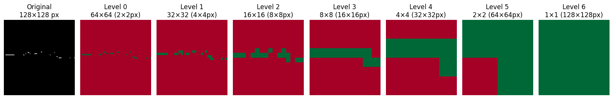

# swin


<!-- WARNING: THIS FILE WAS AUTOGENERATED! DO NOT EDIT! -->

## Design Overview

### Motivation: Multi-Scale Understanding

We’re not doing mere image segmentation. The representations at
different scales may be very different from one another and mapped
non-linearly. Consider: the top-level representation could be something
about musical genre. The next level down could be something about what
part of the song we’re in. The next level down could be which part of
the verse or chorus we’re in. The next level could be a given musical
phrase. The next level could be the individual notes in the phrase.

### Same Info, Organized Differently

**ViT:** The default ViT we’ve been using has 65 patches with 256
dimensions each: 65 \* 256 = **16,640 encoding parameters**.

For the a Swin with 6 stages, `embed_dim=8`, `patch_h=patch_w=4`, so the
finest grid is 32×32:

<table>
<thead>
<tr>
<th>Level</th>
<th>Patch Size (px)</th>
<th>Grid</th>
<th>Dim</th>
<th>Scalars</th>
</tr>
</thead>
<tbody>
<tr>
<td>0 (coarsest)</td>
<td>128x128</td>
<td>1×1</td>
<td>256</td>
<td>256</td>
</tr>
<tr>
<td>1</td>
<td>64x64</td>
<td>2×2</td>
<td>128</td>
<td>512</td>
</tr>
<tr>
<td>2</td>
<td>32x32</td>
<td>4×4</td>
<td>64</td>
<td>1,024</td>
</tr>
<tr>
<td>3</td>
<td>16x16</td>
<td>8×8</td>
<td>32</td>
<td>2,048</td>
</tr>
<tr>
<td>4</td>
<td>8x8</td>
<td>16×16</td>
<td>16</td>
<td>4,096</td>
</tr>
<tr>
<td>5 (finest)</td>
<td>4x4</td>
<td>32x32</td>
<td>8</td>
<td>8,192</td>
</tr>
<tr>
<td><strong>Total</strong></td>
<td></td>
<td></td>
<td><strong>16,128 encoding parameters</strong></td>
<td></td>
</tr>
</tbody>
</table>

…So the Swin has basically the same amount of information as the ViT
(actually slightly less!), it’s just organized differently.

### What this module does

`SwinEncoder` is a drop-in replacement for `ViTEncoder` that uses the
**Swin Transformer V2** architecture. It takes a piano roll image
`(B, 1, 128, 128)` and returns an `EncoderOutput` with hierarchical
multi-scale patch states.

### Why Swin V2?

- **Hierarchical representation**: 7 levels from finest (64×64 grid,
  dim=4) down to a single CLS-like token (1×1, dim=256), compared to
  ViT’s flat single-scale output
- **Efficient attention**: Windowed attention with shifted windows —
  O(N) instead of O(N²)
- **V2 improvements**: Cosine attention with learned log-scale
  temperature, continuous position bias via CPB MLP, res-post-norm for
  training stability

### Architecture

<table>
<thead>
<tr>
<th>Stage</th>
<th>Grid</th>
<th>Patch covers</th>
<th>Dim</th>
<th>Depths</th>
<th>Heads</th>
</tr>
</thead>
<tbody>
<tr>
<td>0</td>
<td>64×64</td>
<td>2×2</td>
<td>4</td>
<td>1</td>
<td>1</td>
</tr>
<tr>
<td>1</td>
<td>32×32</td>
<td>4×4</td>
<td>8</td>
<td>1</td>
<td>1</td>
</tr>
<tr>
<td>2</td>
<td>16×16</td>
<td>8×8</td>
<td>16</td>
<td>2</td>
<td>1</td>
</tr>
<tr>
<td>3</td>
<td>8×8</td>
<td>16×16</td>
<td>32</td>
<td>2</td>
<td>2</td>
</tr>
<tr>
<td>4</td>
<td>4×4</td>
<td>32×32</td>
<td>64</td>
<td>6</td>
<td>4</td>
</tr>
<tr>
<td>5</td>
<td>2×2</td>
<td>64×64</td>
<td>128</td>
<td>2</td>
<td>8</td>
</tr>
<tr>
<td>6</td>
<td>1×1</td>
<td>128×128</td>
<td>256</td>
<td>1</td>
<td>16</td>
</tr>
</tbody>
</table>

Config is in `configs/config_swin.yaml`.

### Implementation approach

We use **timm’s `SwinTransformerV2Stage` directly** — no copied or
modified Swin internals. Our `SwinEncoder` wrapper handles only:

1.  **Patch embedding** — `Conv2d(1, 4, kernel_size=2, stride=2)` +
    LayerNorm
2.  **Empty patch detection** — patches where all pixels are black get a
    learnable `empty_token`
3.  **MAE masking** (SimMIM-style) — masked patches get a learnable
    `mask_token`, grid stays intact so windowed attention works
    unmodified. Two-rate sampling: non-empty patches masked at
    `mask_ratio`, empty patches at `mask_ratio × empty_mask_ratio`
    (default 5%)
4.  **Hierarchical output** — collects each stage’s output into
    `HierarchicalPatchState` (coarsest-first), packaged as
    `EncoderOutput`

### Key differences from ViTEncoder

- No CLS token (stage 6’s single 1×1 token serves as a global summary)
- No RoPE (Swin V2 uses its own continuous position bias)
- MAE masking keeps all tokens (SimMIM-style) — no compute savings but
  preserves spatial grid
- `empty_mask_ratio` controls how often trivial-to-reconstruct empty
  patches are masked

### TODOs

- `HierarchicalPatchState` could store `window_size` per level
- `EncoderOutput` could store scale metadata (downsample factors per
  level)

### Future: advanced masking & representation learning

- **Inter-stage patch masking**: dropout-style masking between encoder
  stages, tapered ratio per stage (`mae_ratio / 2**stage_idx`), using a
  learnable mask token. Forces robust representations at every scale.
- **Self-distillation** (DINO/iBOT-style): EMA teacher provides latent
  targets at all scales, eliminating need for pixel-level reconstruction
  at coarser levels.
- **Multi-scale reconstruction losses**: reconstruct downsampled piano
  rolls at each hierarchy level (requires bidirectional decoder,
  e.g. U-Net with skip connections).

------------------------------------------------------------------------

### SwinEncoder

``` python

def SwinEncoder(
    img_height:int, # Input image height in pixels (e.g. 128)
    img_width:int, # Input image width in pixels (e.g. 128)
    patch_h:int=4, # Patch height for initial embedding
    patch_w:int=4, # Patch width for initial embedding
    in_chans:int=1, # Number of input channels (1 for piano roll)
    embed_dim:int=8, # Base embedding dimension (doubles each stage)
    depths:tuple=(1, 2, 2, 6, 2, 1), # Number of transformer blocks per stage
    num_heads:tuple=(1, 1, 2, 4, 8, 16), # Attention heads per stage
    window_size:int=8, # Window size for windowed attention
    mlp_ratio:float=4.0, # MLP hidden dim = embed_dim * mlp_ratio
    qkv_bias:bool=True, # Add bias to QKV projections
    drop_rate:float=0.0, # Dropout after patch embedding
    proj_drop_rate:float=0.0, # Dropout after attention projection
    attn_drop_rate:float=0.0, # Dropout on attention weights
    drop_path_rate:float=0.1, # Stochastic depth rate
    norm_layer:type=LayerNorm, # Normalization layer class
    mae_ratio:float=0.0, # Fraction of non-empty patches to mask (0=no masking)
    empty_mask_ratio:float=0.05, # Mask rate for empty patches relative to mae_ratio
):

```

*Swin Transformer V2 Encoder for midi-rae — drop-in replacement for
ViTEncoder. (Wrapper for timm routines)*

``` python
# Test: verify SwinEncoder output shapes
B, C, H, W = 2, 1, 128, 128
enc = SwinEncoder(img_height=H, img_width=W)
x = torch.randn(B, C, H, W)
out = enc(x)

print(f'mae_mask:        {out.mae_mask.shape}')
print(f'full_pos:        {out.full_pos.shape}')
print(f'full_non_empty:  {out.full_non_empty.shape}')
print(f'num levels:      {len(out.patches.levels)}')
for i, ps in enumerate(out.patches.levels):
    g = int(ps.pos.shape[0]**0.5)
    p = H // g
    print(f'  level {i}: emb={ps.emb.shape}, pos={ps.pos.shape}  — grid {g}×{g} ({p}×{p} patch{"es" if ps.emb.shape[1]>1 else ""})')

# Expected hierarchy (coarsest first), 128×128 image, 2×2 patches:
#   level 0 (coarsest): emb=(1, 1,    256) — grid 1×1  (CLS-like)
#   level 1:            emb=(1, 4,    128) — grid 2×2
#   level 2:            emb=(1, 16,    64) — grid 4×4
#   level 3:            emb=(1, 64,    32) — grid 8×8
#   level 4:            emb=(1, 256,   16) — grid 16×16
#   level 5:            emb=(1, 1024,   8) — grid 32×32
#   level 6 (finest):   emb=(1, 4096,   4) — grid 64×64
```

    mae_mask:        torch.Size([2, 4096])
    full_pos:        torch.Size([4096, 2])
    full_non_empty:  torch.Size([2, 4096])
    num levels:      7
      level 0: emb=torch.Size([2, 1, 256]), pos=torch.Size([1, 2])  — grid 1×1 (128×128 patch)
      level 1: emb=torch.Size([2, 4, 128]), pos=torch.Size([4, 2])  — grid 2×2 (64×64 patches)
      level 2: emb=torch.Size([2, 16, 64]), pos=torch.Size([16, 2])  — grid 4×4 (32×32 patches)
      level 3: emb=torch.Size([2, 64, 32]), pos=torch.Size([64, 2])  — grid 8×8 (16×16 patches)
      level 4: emb=torch.Size([2, 256, 16]), pos=torch.Size([256, 2])  — grid 16×16 (8×8 patches)
      level 5: emb=torch.Size([2, 1024, 8]), pos=torch.Size([1024, 2])  — grid 32×32 (4×4 patches)
      level 6: emb=torch.Size([2, 4096, 4]), pos=torch.Size([4096, 2])  — grid 64×64 (2×2 patches)

Testing code to check for non-empty patches: Green equals non-empty, red
equals empty

``` python
import matplotlib.pyplot as plt
import torch.nn.functional as F
from midi_rae.data import PRPairDataset

# Load one image from the dataset
ds = PRPairDataset(split='val')
img_tensor = ds[0]['img1'][:1]
x = img_tensor.unsqueeze(0)

# Run empty patch detection
enc = SwinEncoder(img_height=128, img_width=128)
non_empty = enc._compute_non_empty(x)
ne = non_empty[0].reshape(1, 1, 64, 64).float()

# Build hierarchy via max-pool cascade
levels = [ne[0, 0].cpu()]  # 64×64
while levels[-1].shape[0] > 1:
    ne = F.max_pool2d(ne, 2)
    levels.append(ne[0, 0].cpu())

# Plot: original image + all levels
fig, axes = plt.subplots(1, len(levels) + 1, figsize=(16, 2.7))
axes[0].imshow(img_tensor[0].cpu(), cmap='gray', origin='lower', aspect='auto')
axes[0].set_title('Original\n128×128 px')
for i, grid in enumerate(levels):
    g = grid.shape[0]
    axes[i+1].imshow(grid.numpy(), cmap='RdYlGn', origin='lower', aspect='auto', vmin=0, vmax=1)
    p = 128 // g
    axes[i+1].set_title(f'Level {i}\n{g}×{g} ({p}×{p}px)')
    axes[i+1].axis('off')
axes[0].axis('off')
plt.tight_layout()
plt.show()
```

    Loading 273 val files from ~/datasets/POP909_images/...
    Finished loading.



------------------------------------------------------------------------

### PixelShuffleHead

``` python

def PixelShuffleHead(
    out_channels:int=1, fpn_dim:int=64, hidden_ch:int=64, patch_size:int=4, grid_h:int=32, grid_w:int=32
):

```

*Base class for all neural network modules.*

Your models should also subclass this class.

Modules can also contain other Modules, allowing them to be nested in a
tree structure. You can assign the submodules as regular attributes::

    import torch.nn as nn
    import torch.nn.functional as F

    class Model(nn.Module):
        def __init__(self) -> None:
            super().__init__()
            self.conv1 = nn.Conv2d(1, 20, 5)
            self.conv2 = nn.Conv2d(20, 20, 5)

        def forward(self, x):
            x = F.relu(self.conv1(x))
            return F.relu(self.conv2(x))

Submodules assigned in this way will be registered, and will also have
their parameters converted when you call :meth:`to`, etc.

.. note:: As per the example above, an `__init__()` call to the parent
class must be made before assignment on the child.

:ivar training: Boolean represents whether this module is in training or
evaluation mode. :vartype training: bool

------------------------------------------------------------------------

### SwinMAEDecoder

``` python

def SwinMAEDecoder(
    patch_size:int=4, dims:tuple=(256, 128, 64, 32, 16, 8), fpn_dim:int=64, depth:int=2, heads:int=4
):

```

*FPN-style MAE decoder for SwinEncoder hierarchical output.* Top-down
pathway fuses all levels, reconstructs at finest scale.

------------------------------------------------------------------------

### SwinDecoder

``` python

def SwinDecoder(
    img_height:int=128, # Output image height
    img_width:int=128, # Output image width
    patch_h:int=4, # Patch height (must match encoder)
    patch_w:int=4, # Patch width (must match encoder)
    out_channels:int=1, # Output channels (1 for piano roll)
    embed_dim:int=8, # Base embedding dim (same as encoder)
    depths:tuple=(1, 2, 2, 6, 2, 1), # Encoder depths (finest→coarsest); reversed internally
    num_heads:tuple=(1, 1, 2, 4, 8, 16), # Encoder heads (finest→coarsest); reversed internally
    window_size:int=8, # Window size for windowed attention
    mlp_ratio:float=4.0, # MLP hidden dim = dim * mlp_ratio
    qkv_bias:bool=True, # Bias in QKV projections
    drop_path_rate:float=0.1, # Stochastic depth rate
    proj_drop_rate:float=0.0, # Dropout after attention projection
    attn_drop_rate:float=0.0, # Dropout on attention weights
    norm_layer:type=LayerNorm
):

```

*Swin V2 Decoder for midi-rae — symmetric multi-stage decoder.*

Mirrors the encoder architecture: processes coarsest→finest with Swin V2
windowed attention at every spatial scale, fusing encoder skip
connections via lateral projections at each level.

Pass the same config values (embed_dim, depths, num_heads) as the
encoder; they are reversed internally for the coarsest→finest decode
direction.

Takes EncoderOutput directly (same interface as SwinMAEDecoder).

TODO: Try ConvTranspose2d or PixelShuffle as alternatives to linear
unpatchify. TODO: Make the unpatchify head swappable via a factory or
argument.

------------------------------------------------------------------------

### PatchExpand

``` python

def PatchExpand(
    in_dim, out_dim, norm_layer:type=LayerNorm
):

```

*Inverse of patch merging: doubles spatial resolution via learned linear
expansion.* (B, H, W, C_in) → (B, 2H, 2W, C_out)

Test: verify SwinDecoder output shapes:

``` python
B, C, H, W = 2, 1, 128, 128
depths, num_heads = (1,2,2,6,2,1), (1,1,2,4,8,16)
enc = SwinEncoder(img_height=H, img_width=W, patch_h=4, patch_w=4,
                  embed_dim=8, depths=depths, num_heads=num_heads)
dec = SwinDecoder(img_height=H, img_width=W, patch_h=4, patch_w=4,
                  embed_dim=8, depths=depths, num_heads=num_heads)

x = torch.randn(B, C, H, W)
enc_out = enc(x)
recon = dec(enc_out)

print(f'Input:  {x.shape}')
print(f'Output: {recon.shape}')
assert recon.shape == x.shape, f'Shape mismatch: {recon.shape} != {x.shape}'
print('✓ Shapes match!')

enc_params = sum(p.numel() for p in enc.parameters())
dec_params = sum(p.numel() for p in dec.parameters())
print(f'Encoder params: {enc_params:,}')
print(f'Decoder params: {dec_params:,}')
```

    Input:  torch.Size([2, 1, 128, 128])
    Output: torch.Size([2, 1, 128, 128])
    ✓ Shapes match!
    Encoder params: 1,748,135
    Decoder params: 1,035,735
